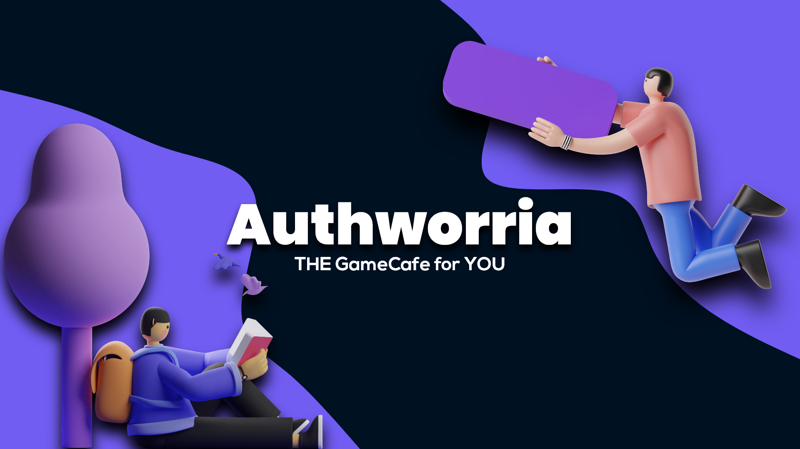

# Information
<p align="center" style="text-align: center;">            
<!--   -->
 
 


</p>

<p align="center" style="text-align: center;">            
          <strong>Website</strong>: <a href="https://authworria.com">https://authworria.com</a> <strong>| Support Email</strong>: <a href="mailto://ray@authworria.com">ray@authworria.com </a>
</p>

</img>

The purpose of this project, which was made for the International Baccalaureate Personal Project, is to develop a website where you can not only game with each other but also socialize with them, combining the gaming experience with the experience of grabbing a cup of coffee with a mate at a cafe.

## Backstory
The word `Authworria` is defined as `the growing anxiety while completing a story before its fast-approaching deadline.` I picked this name for the project to reflect my concern about finishing it before the deadline, which is rapidly approaching.

## Explanation
This project uses Google's [Firebase](https://firebase.google.com) to host and authenticate users

### Authentication
```js
var provider = new firebase.auth.GoogleAuthProvider();
          firebase
            .auth()
            .signInWithPopup(provider)
            .then(res=>{
              // code here
                }).catch(e => {
              console.log(e);
            });
```
This line of code is essential for Firebase to authenticate users, and the `.signInWithPopup` will open a popup window prompting the user to sign in/up. We can also use `.signInWithRedirect` instead to redirect visitors to a page where they would sign in from and is more preffered on mobile browsers.

```js
document.getElementById("dashboard").style.display = "block";
document.getElementById("loginscreen").style.display = "none";
```
I use the method `.getElementById` to get the HTML element associated with that value, which is the "dashboard" and "loginscreen" in this example. Then I alter the css value of the elements with `.style`. `.display = "block"` makes the element visible, whereas `.display = "none"` makes it invisible. As a result, after the user logs in, the "loginscreen" is replaced with the "dashboard".

### 

<!-- 
# TODO
- [ ] Task title ~3d #type @name yyyy-mm-dd  
  - [ ] Sub-task or description  
- [x] Completed task title 
-->

# TODO
- [ ] Sign In & Sign Up
  - [x] Create the login / signup page
  - [ ] Google and other methods of signing in
  - [x] Get data from the login and send to dashboard
  - [ ] Username filter
- [ ] Web-Chat
  - [ ] Validate the users identity using a token
  - [ ] Create web-chat page
  - [ ] Add a word filter to block inappropriate messages
- [ ] Multiplayer Web-Game
  - [ ] Authorize users with their token
  - [ ] Design the game
  - [ ] Add web-chat to the game
