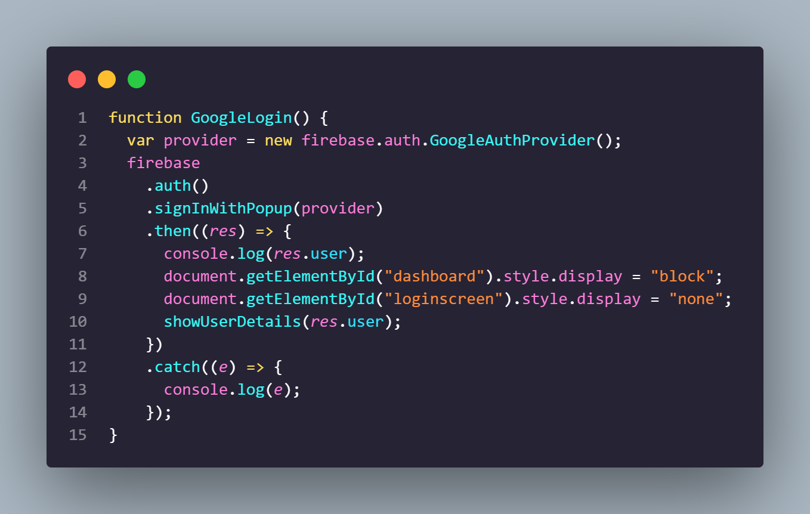
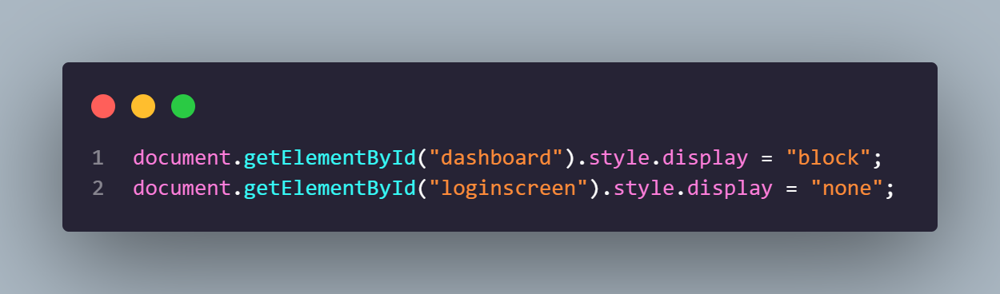

# Information

            
<!--   -->
 
 

            
          <kbd><strong>Website</strong>: <a href="https://authworria.com">https://authworria.com</a><strong> ⑊ Support Email</strong>: <a href="mailto://ray@authworria.com">ray@authworria.com</a></kbd>

</img>

The purpose of this project, which was made for the International Baccalaureate Personal Project, is to develop a website where you can not only game with each other but also socialize with them, combining the gaming experience with the experience of grabbing a cup of coffee with a mate at a cafe.

## Backstory

The word `Authworria` is defined as `the growing anxiety while completing a story before its fast-approaching deadline.` I picked this name for the project to reflect my concern about finishing it before the deadline, which is rapidly approaching.

## Explanation

The website is made using [Node.js](https://nodejs.org/en/), [Express](https://expressjs.com/), [Firebase](https://www.firebase.com/), [Socket.io](https://socket.io/), [Porkbun](https://www.porkbun.com), [Bootstrap](https://getbootstrap.com/), [Font Awesome](https://fontawesome.com/), and [Google Fonts](https://fonts.google.com/).

## Known Bugs

- User cant get into the /app or /login. [#1](https://github.com/TheIIISociety/Authworria/issues/1)

### Authentication

The authentication is done using Firebase's [Google authentication](https://firebase.google.com/docs/auth/web/google-signin).

</img>

This line of code is essential for Firebase to authenticate users, and the `.signInWithPopup` will open a popup window prompting the user to sign in/up. We can also use `.signInWithRedirect` instead to redirect visitors to a page where they would sign in from and is more preffered on mobile browsers.

</img>

I use the method `.getElementById` to get the HTML element associated with that value, which is the "dashboard" and "loginscreen" in this example. Then I alter the css value of the elements with `.style`. `.display = "block"` makes the element visible, whereas `.display = "none"` makes it invisible. As a result, after the user logs in, the "loginscreen" is replaced with the "dashboard".

###

<!--
# TODO
- [ ] Task title ~3d #type @name yyyy-mm-dd
  - [ ] Sub-task or description
- [x] Completed task title
-->

# TODO

- [ ] Sign In & Sign Up
  - [x] Create the login / signup page
  - [x] Google and other methods of signing in
  - [x] Get data from the login and send to dashboard
  - [ ] Username filter
- [ ] Web-Chat
  - [x] Validate the users identity using a token
  - [x] Create web-chat page
  - [ ] Add a word filter to block inappropriate messages
  - [ ] Servers and Direct Messages
  - [ ] Create a chatroom for each game
  - [ ] Custom status
    - [ ] Show own status in the profile section
    - [x] Make others be able to see your status
    - [x] Be able to change the status or remove it.
- [ ] Multiplayer Web-Game
  - [ ] Authorize users with their token
  - [ ] Design the game
  - [ ] Add web-chat to the game
